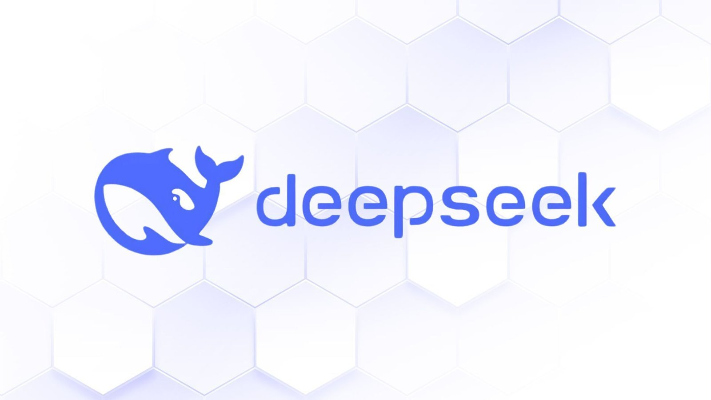

## 10-Mar-2025

# Speaker Profile

<table>
  <tr>
    <td></td>
    <td style="vertical-align: middle; padding-left: 15px;">
      <strong>Name:</strong> Ryan Heida  
      <strong>LinkedIn:</strong> <a href="https://www.linkedin.com/in/ryan-heida">ryan-heida</a>  
      <strong>Other Links:</strong> <a href="https://links.ryanheida.com">links.ryanheida.com</a>
    </td>
  </tr>
</table>

---

# DeepSeek AI: A Revolutionary AI Model

## Introduction
DeepSeek AI is emerging as a powerful competitor in the artificial intelligence landscape. Unlike other AI giants, it achieves **high efficiency with fewer resources**, making it a game-changer in AI research and application. This document explores DeepSeek AI’s innovations, key features, and implications for AI development.

---

## 🚀 Key Innovations of DeepSeek AI

- **Cost-Efficient Model:** Uses fewer GPUs, personnel, and resources than OpenAI while maintaining competitive AI performance.
- **Store Recall Precision Reduction:** Reduces stored decimal places in neural network weights, enhancing both **speed and accuracy**.
- **Full Context Processing:** Processes the **entire context at once**, improving response quality.
- **Mixture of Experts (MoE) System:** Activates **only 37 billion parameters** from a total of **671 billion**, increasing efficiency and reducing computational load.
- **Text-to-Image Generation:** Introduced a **text-to-image model** called **Jings**.
- **Logical Thought Processing:** Enhances AI’s reasoning by displaying structured thought processes.
- **Local Execution Capability:** Can run efficiently on **consumer CPUs** with reasonable token processing speed.
- **Compact Team:** Operates with a small, highly skilled **team of about 200 employees**.
- **Impact on AI Hardware & Market:** Potentially influences **Nvidia’s stock** and changes strategies for AI leaders like OpenAI.
- **Advanced Text Summarization:** Capable of producing **highly accurate and concise summaries**.

---

## 🤖 DeepSeek AI for Developers

### 1️⃣ Code Generation & Assistance
- **Generates** code snippets for various programming languages.
- **Provides real-time suggestions** for better coding practices.
- **Enhances understanding** of libraries and frameworks.

### 2️⃣ Debugging & Error Detection
- **Identifies bugs** in code instantly.
- **Predicts vulnerabilities** to enhance security.
- **Suggests optimized algorithms** for improved performance.

### 3️⃣ Automated Testing
- **Generates test cases** automatically.
- Uses **AI-driven bug detection** for higher reliability.
- Supports **CI/CD pipelines** for seamless integration.

### 4️⃣ NLP & AI Applications
- Helps develop **AI-powered chatbots**.
- **Automates text analysis** for insights.
- Improves **search algorithms** for better results.

## ✨ DeepSeek AI for Content Creators

### 1️⃣ Automated Content Generation
- Writes **high-quality blog posts** and product descriptions.
- Suggests **trending topics** to boost engagement.
- Enhances content **with unique perspectives**.

### 2️⃣ SEO Optimization
- Identifies **high-ranking keywords**.
- Analyzes competitors and **suggests improvements**.
- Generates **SEO-friendly meta descriptions**.

### 3️⃣ Social Media Assistance
- Creates **engaging captions & hashtags**.
- Schedules posts for **consistent audience engagement**.
- **Generates AI-powered images and videos**.

### 4️⃣ Editing & Proofreading
- Checks **grammar, spelling, and style**.
- **Detects plagiarism** to ensure originality.
- Enhances sentence flow and readability.

---

## 🧐 Discussion Points

### Vocabulary & Expressions
- **Mixture of Experts (MoE)** – A technique where only certain model parameters are activated per task.
- **Full Context Processing** – Feeding entire inputs at once instead of in parts.
- **Precision Reduction** – Reducing unnecessary decimal points for efficiency.
- **Text-to-Image Generation** – AI-driven image creation from text prompts.

### Questions for Discussion
1. How does DeepSeek AI differ from OpenAI’s models?
2. What are the benefits of Mixture of Experts (MoE) in AI models?
3. Could DeepSeek AI’s cost efficiency reshape AI industry standards?
4. How can DeepSeek AI impact the **job market** for developers and content creators?
5. What ethical considerations arise from AI-generated content?

---

## ❓ FAQs About DeepSeek AI

### 1️⃣ What makes DeepSeek AI unique?
DeepSeek AI operates **more efficiently** than traditional models, using fewer resources while maintaining high performance.

### 2️⃣ Can DeepSeek AI generate code?
Yes! It assists with **code generation, debugging, and optimization** across multiple languages.

### 3️⃣ How does DeepSeek AI help with SEO?
It identifies **top-performing keywords, competitor strategies, and metadata optimizations** to improve content visibility.

### 4️⃣ Does DeepSeek AI work offline?
Yes, it can be run locally on CPUs, making it accessible even without cloud resources.

### 5️⃣ Who can benefit from DeepSeek AI?
Both **developers and content creators** can enhance productivity and efficiency using its AI-driven features.

---

## 📌 Conclusion
DeepSeek AI is **revolutionizing AI development**, making advanced tools accessible with fewer resources. Whether you’re a **developer optimizing code** or a **content creator crafting engaging content**, DeepSeek AI is a powerful tool that helps you **work smarter, not harder**. Its **innovative architecture** is shaping the future of AI, making it an exciting topic to explore!

-----------

-----------

## 💯 Words and Expressions

### 📝 20 Useful Words for Your Conversation on DeepSeek AI  
1. **Artificial Intelligence (AI)** – The simulation of human intelligence by machines.  
2. **Neural Network** – A computing system inspired by the human brain.  
3. **Machine Learning** – A subset of AI that enables computers to learn from data.  
4. **Natural Language Processing (NLP)** – AI's ability to understand and process human language.  
5. **Algorithm** – A set of rules for solving a problem in a step-by-step manner.  
6. **Deep Learning** – A type of machine learning using large neural networks.  
7. **Model Training** – The process of teaching an AI model using data.  
8. **Fine-tuning** – Adjusting a pre-trained AI model to perform better on a specific task.  
9. **Inference** – When an AI model makes predictions based on learned data.  
10. **Tokenization** – Breaking text into smaller pieces (tokens) for AI processing.  
11. **Context Window** – The amount of text an AI model can consider at one time.  
12. **Mixture of Experts (MoE)** – A method where only parts of an AI model are activated per input.  
13. **Computational Efficiency** – How well an AI model performs given limited resources.  
14. **Parameter** – A numerical value that AI models adjust to improve performance.  
15. **Optimization** – The process of improving AI model performance.  
16. **Summarization** – The ability of AI to generate concise versions of long texts.  
17. **Bias in AI** – Unfair or skewed decision-making by AI models.  
18. **Generative AI** – AI that can create new content, such as text or images.  
19. **Prompt Engineering** – The process of crafting inputs to get better AI responses.  
20. **Deployment** – Making an AI model available for users or applications.  

---

### 🔥 10 Useful Expressions for Discussion  
1. **"DeepSeek AI is a game-changer in the AI industry."**  
2. **"Unlike traditional AI models, DeepSeek AI is highly efficient and cost-effective."**  
3. **"One of its most impressive features is the Mixture of Experts (MoE) system."**  
4. **"DeepSeek AI reduces computational costs while maintaining high performance."**  
5. **"Its ability to process full context at once makes it stand out from competitors."**  
6. **"AI models like DeepSeek are reshaping how we generate and analyze content."**  
7. **"Summarization and text generation have become significantly more advanced."**  
8. **"One challenge of AI is ensuring fairness and minimizing bias."**  
9. **"The future of AI depends on balancing innovation with ethical considerations."**  
10. **"With AI advancements, companies must adapt to stay competitive."**  
